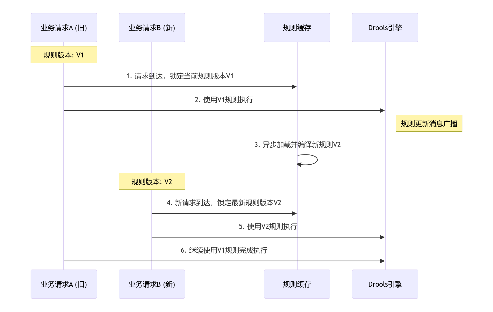

## 当业务人员在规则管理界面上修改并发布新规则后
### 规则更新与通知：
规则管理服务发布新规则，生成新版本V2，存入数据库并缓存至Redis。
规则管理服务通过MQ广播一条消息，内容包含新规则的版本号或标识符 。
### 实例接收与准备：
所有Drools实例监听MQ。收到消息后，异步地从Redis或数据库拉取V2规则的DRL内容。
实例在后台编译这些规则，生成新的KieBase对象，并将其放入本地缓存，Key为版本号"V2"。此时，正在处理的业务请求不受影响，仍使用V1的KieBase。
### 业务请求处理：
对于MQ通知前已开始的请求：它们已绑定版本V1，会继续使用V1的KieBase创建会话执行，保证一致性。
对于MQ通知后新到的请求：它们会获取到当前最新版本V2，使用V2的KieBase创建会话执行。
关键点：规则更新不会阻塞或中断正在进行的业务。切换是在下一个新请求到来时自然发生的。

## 总体方案汇总
1. 核心策略 - 版本化标记 + 请求级别规则绑定
   为每个规则集设定版本号，为每个业务请求绑定一个固定的规则版本，从而实现单个业务生命周期内的规则一致性。
2. 规则更新时机 - 异步通知，延迟生效
   规则更新消息（MQ）仅作为通知，新规则在下一个新到达的请求生效，当前正在处理的所有请求仍使用旧规则。
3. 数据一致性 - 保证单个请求内的规则一致性
   一个业务请求的完整流程（可能涉及多次规则调用）均使用同一版本的规则，避免因规则中途变更导致结果混乱。
4. 技术实现 - KieBase缓存策略
   维护一个以版本号为Key的 KieBase缓存（如 ConcurrentHashMap<String, KieBase>）。业务请求根据其携带的版本Key获取对应的 KieSession。

## 架构示意图

## 优化点考量
灰度发布与A/B测试：你可以在业务请求的上下文（如HTTP Header或消息属性）中携带一个标记。规则执行服务根据这个标记（如experiment_group: group_b）来决定是使用稳定的V1规则还是新的V2规则，从而实现灰度发布和A/B测试。
旧版本清理：实现一个简单的清理机制，定期检查并驱逐长时间没有业务请求使用的旧版本KieBase，避免内存泄漏。
